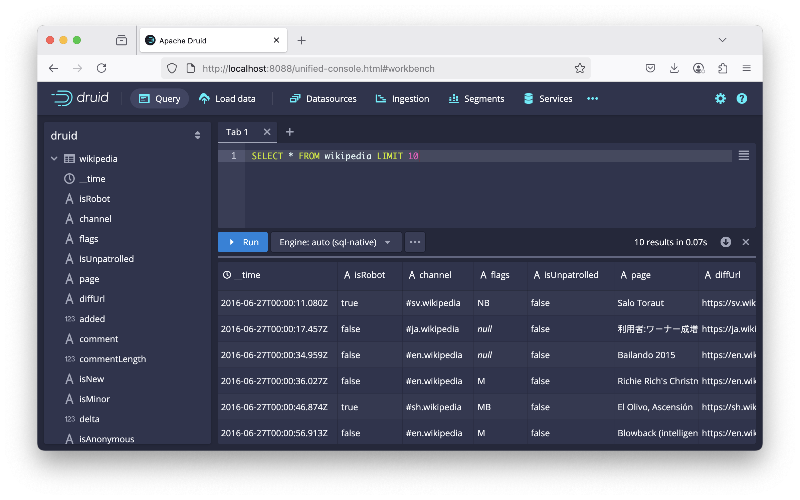

# Apache Druid on Kubernetes with kind

This repository provides a setup guide for running Apache Druid locally using Kubernetes-in-Docker (kind) and the Druid Operator, using https://github.com/datainfrahq/druid-operator and https://github.com/minio/operator (local S3 bucket)



### Prerequisites

* `docker`, e.g. `brew install docker` on MacOS, possibly with https://github.com/abiosoft/colima
* [kind](https://kind.sigs.k8s.io/docs/user/quick-start/#installation)
* [kubectl](https://kubernetes.io/docs/tasks/tools/install-kubectl/)
* [helm](https://helm.sh/docs/intro/install/)

If running using Colima, make sure you have enough resource, e.g.
```
colima start --memory 12 --cpu 6 --disk 100
```

### Setup
```
./setup.sh
```
Follow instructions, Druid will be available at http://localhost:8088 and Superset on http://localhost:8080 (after port-forwarding).

The `setup.sh` script is idempotent, so can be rerun again in case something failed/timed out.

### Clean up
```
kind delete cluster --name druid
```

### PostgreSQL Metadata Store

This setup uses PostgreSQL 15 as the metadata store instead of the default Derby database. The PostgreSQL instance is deployed as a Kubernetes deployment with the following configuration:

- **Database**: `druid`
- **User**: `druid`
- **Password**: `druid123`
- **Host**: `postgresql.druid.svc.cluster.local:5432`

Use e.g. https://www.beekeeperstudio.io/ to access database (after portforwarding locally). To see segments, run e.g.

```
SELECT convert_from(payload, 'UTF-8') FROM druid_segments;
```
